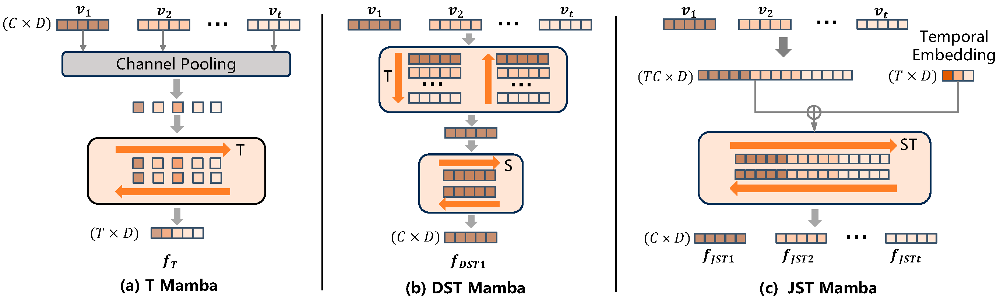

# H-MBA
H-MBA: Hierarchical MamBa Adaptation for Multi-Modal Video Understanding in Autonomous Driving （AAAI 2025）
### Introduction for H-MBA ###

With the prevalence of Multimodal Large Language Models(MLLMs), autonomous driving has encountered new opportunities and challenges. 
In particular, multi-modal video understanding is critical to interactively analyze what will happen in the procedure of autonomous driving.
However, videos in such a dynamical scene that often contains complex spatial-temporal movements,
which restricts the generalization capacity of the existing MLLMs in this field.
To bridge the gap, 
we propose a novel $\textbf{H}ierarchical$ $\textbf{M}am\textbf{ba}$ $Adaptation$ (H-MBA) framework to fit the complicated motion changes in autonomous driving videos.
It has two main structures, e.g., C-Mamba and Q-Mamba.
C-Mamba contains various types of structure state space models,
which can effectively capture multi-granularity video context for different temporal resolutions.
Q-Mamba flexibly transforms the current frame as the learnable query, 
and attentively selects multi-granularity video context into query.
Consequently,
it can adaptively integrate all the video contexts of multi-scale temporal resolutions to enhance video understanding.
Via a plug-and-play paradigm in MLLMs,
our H-MBA enables image based MLLM models to understand video contents, 
and shows remarkable performance on multi-modal video tasks in autonomous driving,
e.g., for risk object detection, 
it outperforms the previous SOTA method with 5.5\% mIoU improvement.

    
	

    
	

